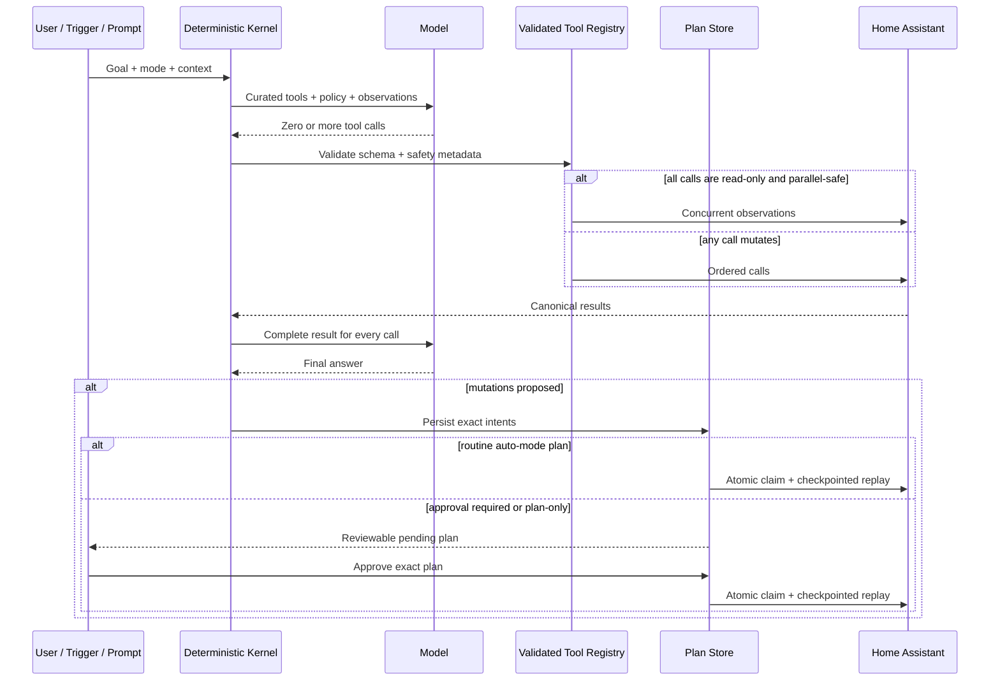

# 2026 Project Review and Modernization

**Review date:** 2026-07-11
**Release:** 0.12.0

## Executive conclusion

The valuable idea was already present: a Home Assistant-native agent that can observe the real environment, remember prior work, propose reviewable plans, and act through constrained tools. The project did not need another agent framework layered over it. It needed one authoritative execution kernel and stronger runtime guarantees.

The modernization therefore keeps the differentiated product surface—native HA context, local privacy, memory, proactive triggers, prompt workflows, approval, and generated dashboards—while replacing framework-era and prompt-enforced behavior with deterministic code.

## What the review found

### Strengths worth preserving

- Direct Home Assistant WebSocket state and service integration.
- Native entity discovery, optional external MCP, and built-in workflows.
- Local Ollama as the default instead of cloud lock-in.
- Plan → Approve → Execute and a visible reasoning trace.
- Episodic memory with recency and feedback weighting.
- Cron and state-change triggers for proactive operation.
- Dashboard Studio and a no-code agent factory.
- Broad model-free test coverage and graceful degradation.

### Critical architecture findings

1. **Two competing brains existed.** The old orchestrator compiled a LangGraph containing no-op nodes, then bypassed it with a separate manual sequence. The newer deep-reasoning harness performed the real work.
2. **The approval queue was initialized too late.** `MCPServer` permanently received `None`, so high-impact generic services could not enter a working approval flow.
3. **Native generic service calls bypassed local policy.** `ha_call_service` could reach the HA client directly instead of applying blocked domains, service allowlists, and approval policy.
4. **Claude tool continuation was invalid.** OpenAI-style `tool` role messages were sent directly to Anthropic, which requires assistant `tool_use` blocks followed immediately by user `tool_result` blocks. Signed thinking blocks were also discarded.
5. **Modern reasoning state was lost.** Chat Completions could not preserve GPT‑5.6 reasoning items between tool turns as recommended for reasoning models.
6. **Provider selection could drift silently.** A configured Anthropic key could override another selected provider, and failed remote configuration silently fell back to Ollama with a cloud model ID.
7. **Tool execution semantics were underspecified.** Every tool batch ran in parallel, including mutations; inputs outside local MCP were not centrally validated; large results were sliced into invalid JSON; retries, total tool budgets, and duplicate protection were absent.
8. **Plan execution was only request-idempotent, not concurrency-safe.** Two simultaneous execute requests could both observe a pending plan and replay it.
9. **Run state was shared and mutable.** System prompts, interceptors, and streaming callbacks were changed on a singleton harness, allowing concurrent runs to corrupt one another.
10. **Legacy cadence loops were expensive and risky.** Single-shot specialist models could act periodically and independently while the modern reasoner and triggers operated in parallel.
11. **Background tasks were abandoned at shutdown.** Startup tasks were not retained or cancelled explicitly.
12. **Dependencies had frozen around 2024-era constraints.** LangGraph 0.2 was unused, ChromaDB 0.5 forced NumPy 1.x, MCP resolved to 1.1, and the dashboard contained high-severity build-chain vulnerabilities.
13. **Generated dashboards were same-origin code.** LLM-produced HTML/JavaScript ran in an unsandboxed iframe and could reach application APIs. It now runs with an opaque origin, restrictive CSP, and parent-mediated state snapshots.

## Research basis

The implementation was checked against current first-party material rather than framework comparison blogs.

### OpenAI

- [Agents SDK overview](https://developers.openai.com/api/docs/guides/agents)
- [OpenAI Agents SDK](https://openai.github.io/openai-agents-python/)
- [Function calling](https://developers.openai.com/api/docs/guides/function-calling)
- [Using GPT-5.6](https://developers.openai.com/api/docs/guides/latest-model)
- [GPT-5.6 model catalog](https://developers.openai.com/api/docs/models)

Relevant conclusions:

- Use Responses directly when the application must own custom loops, tools, state, and branching.
- Return a result for every function call and preserve reasoning items across reasoning-model tool turns.
- Prefer strict schemas, a small initial tool surface, clear approval boundaries, and representative evaluations.
- GPT‑5.6 recommends Responses, explicit reasoning effort, persisted reasoning, and bounded programmatic tooling only where intermediate processing is deterministic.

### Anthropic

- [Building effective agents](https://www.anthropic.com/engineering/building-effective-agents)
- [Claude model overview](https://platform.claude.com/docs/en/about-claude/models/overview)
- [Define tools](https://platform.claude.com/docs/en/agents-and-tools/tool-use/implement-tool-use)
- [Handle tool calls](https://platform.claude.com/docs/en/agents-and-tools/tool-use/handle-tool-calls)
- [Strict tool use](https://platform.claude.com/docs/en/agents-and-tools/tool-use/strict-tool-use)
- [Adaptive thinking](https://platform.claude.com/docs/en/build-with-claude/adaptive-thinking)
- [Effort](https://platform.claude.com/docs/en/build-with-claude/effort)
- [Claude Agent SDK](https://code.claude.com/docs/en/agent-sdk/overview)

Relevant conclusions:

- Prefer simple, composable workflows and direct APIs when a framework obscures prompts or tool behavior.
- Distinguish deterministic workflows from model-directed agents and use the simplest adequate pattern.
- Invest heavily in the agent-computer interface: detailed tools, high-signal results, ground-truth feedback, stopping conditions, and human checkpoints.
- Claude Opus 4.8 requires adaptive rather than manual thinking; current models reject non-default temperature; signed thinking blocks must be round-tripped unchanged between tool calls.

### MCP

- [MCP tools specification](https://modelcontextprotocol.io/specification/2025-06-18/server/tools)
- [MCP schema reference](https://modelcontextprotocol.io/specification/2025-06-18/schema)

Relevant conclusions:

- Validate inputs and outputs, enforce access control and timeouts, rate-limit, sanitize results, and visibly expose tool use.
- Use structured content/output schemas and return execution errors to the model so it can self-correct.
- Treat tool annotations as untrusted unless the server is trusted. `readOnlyHint` and `idempotentHint` are hints, not security policy.

### LangGraph

- [Durable execution and persistence](https://docs.langchain.com/oss/python/langgraph/durable-execution)
- [Interrupts](https://docs.langchain.com/oss/python/langgraph/interrupts)

Relevant conclusions:

- Durable graphs require real checkpointers, stable thread IDs, idempotent side effects, and explicit interrupts.
- The project used none of those capabilities; retaining a compiled graph of no-op nodes added dependency and conceptual overhead without durability. It was removed rather than upgraded cosmetically.

### Home Assistant

- [Home Assistant LLM API](https://developers.home-assistant.io/docs/core/llm/)
- [Conversation API](https://developers.home-assistant.io/docs/intent_conversation_api/)

Relevant conclusions:

- HA now offers a built-in Assist LLM API, per-request exposed tools, validated tool arguments, conversation IDs, and MCP exposure.
- The next product step should be a native conversation integration using HA `ChatLog`/`LLMContext`, exposed-entity policy, and Assist voice pipelines—not a second dashboard-only chat protocol.

### Hermes benchmark

- [Hermes Home Assistant integration](https://hermes-agent.nousresearch.com/docs/user-guide/messaging/homeassistant/)
- [Hermes Home Assistant add-on](https://github.com/WolframRavenwolf/hermes-ha-addon)
- [Hermes Conversation integration](https://github.com/sj-unit72/hass-hermes)

Hermes currently sets a strong operational baseline:

- four clear HA tools for entity listing, state, services, and service calls;
- filtered real-time `state_changed` intake with per-entity cooldown and reconnect backoff;
- persistent notifications for agent responses;
- persistent memory, self-improving skills, plugins, messaging platforms, profiles, terminal, and an OpenAI-compatible API;
- a community HA conversation integration that preserves `conversation_id` history and connects to Assist voice pipelines.

Its documented HA safety blocks code-execution/SSRF domains and validates entity ID syntax. The opportunity for this project is not to duplicate Hermes' general-purpose agent shell. It is to go deeper on **physical-world policy and verifiable outcomes**: reviewable exact plans, application-owned impact policy, deterministic ordering, execution checkpoints, home-specific conflict handling, simulations, post-action state verification, and scenario regression gates.

## Architecture decision

A vendor agent SDK was not adopted as the central runtime.

Why:

- The system must support local Ollama and several cloud providers.
- Home mutations need application-owned plan interception, allowlists, trusted approval context, exact replay, and HA-specific conflict policy.
- A compact custom loop is easier to audit than adapting multiple SDK lifecycle and permission models.
- OpenAI and Anthropic both explicitly support direct API loops for applications that need this level of control.

Vendor-native capabilities are still used where they improve semantics:

- GPT‑5.6 uses Responses, reasoning effort, encrypted reasoning replay, and complete function-call outputs.
- Claude Opus 4.8 uses strict tools, adaptive thinking, effort, native content blocks, and signed thinking continuity.
- MCP retains structured content, schemas, errors, and metadata.

## New authoritative flow

## Deterministic guarantees added

- JSON Schema validation on every registry call.
- Optional custom validators execute before dry-run simulation.
- Curated initial core surface of 18 local/native tools before optional external MCP tools.
- Native generic HA mutation removed from the model surface.
- Read-only parallelism; mixed or mutating batches are sequential.
- Read-only retries only, bounded with short exponential backoff.
- Per-run read cache invalidated by mutation.
- Idempotent mutation deduplication and non-idempotent duplicate blocking.
- Every provider-requested call receives a tool result, including budget-rejected calls.
- Valid JSON compaction envelopes instead of raw string truncation.
- Iteration, per-turn, total-tool, wall-clock, model-timeout, tool-timeout, context, and result-size budgets.
- Per-run system prompt/interceptor/callback isolation.
- Bounded concurrent runs and streaming backpressure.
- Token/reasoning/cache usage aggregation.
- Atomic plan claim, `executing` state, partial result checkpoints, ordered failure abort, and no automatic replay of uncertain in-flight work.
- Trusted approved execution context that cannot be supplied in model arguments.
- Retained/cancelled background task lifecycle.
- Opaque sandbox + restrictive CSP for generated dashboards; only trusted parent code fetches HA state.

## Breaking changes

1. `reasoning_allow_direct_execute` defaults to `false`. Public callers should use `auto` or `plan`, then execute the persisted plan.
2. `enable_legacy_autonomous_loops` defaults to `false`.
3. `enable_legacy_dashboard_loop` defaults to `false`; Dashboard Studio is the maintained generator.
4. `llm_provider` now includes `anthropic` explicitly.
5. OpenAI defaults to `gpt-5.6-terra`; Anthropic defaults to `claude-opus-4-8`.
6. Remote deep-reasoner configuration fails explicitly instead of silently switching providers.
7. The unsafe native generic service tool is no longer exposed to the model.
8. Python dependencies now require a modern Python 3.11+ environment. LangGraph is removed; ChromaDB is upgraded to 1.5 and NumPy to 2.x.
9. Frontend build requires Node 20.19+; the container uses Node 22.
10. Persisted Chroma data should be backed up before first upgrade. Chroma migrations are automatic but downgrading the same directory is not supported.

## Evaluation strategy

### Runtime contracts

`tests/test_agent_kernel_2026.py` verifies without any model or network:

- invalid argument rejection;
- ordered read/write execution;
- retry boundaries;
- idempotent deduplication;
- non-idempotent duplicate blocking;
- complete protocol results under budgets;
- valid result compaction;
- model timeouts and usage aggregation;
- atomic plan claims;
- dry-run policy enforcement;
- approved high-impact execution without double approval;
- Claude content-block continuity;
- GPT‑5.6 encrypted reasoning continuity;
- provider selection and fail-fast behavior.

### Model behavior

`ai-orchestrator/backend/evals/home_agent_scenarios.yaml` defines representative home goals and deterministic expectations. The scorer deliberately avoids using an LLM judge for mutation count, approval, tool budget, or forbidden-tool assertions.

## Product direction: beyond Hermes

Hermes is already a capable operational monitor/controller and has stronger messaging, voice, plugin, and filtered event-gateway surfaces today. This project should become the **policy-aware learning control plane for the home**, not a thinner general-purpose agent shell:

1. **Native HA conversation entity and Assist pipeline.** Make the reasoner available to voice satellites and preserve HA conversation IDs, device context, language, and exposed-entity policy.
2. **Event-sourced home episodes.** Correlate trigger, observations, plan, approval, actions, HA state deltas, and user feedback into one inspectable episode.
3. **Filtered real-time event intake.** Match Hermes' domain/entity allowlists, noisy-entity exclusions, cooldowns, heartbeat, and reconnect behavior, then feed events into deterministic trigger/policy evaluation before invoking a model.
4. **Outcome verification.** After replay, re-observe affected entities and mark each intent verified, failed, or uncertain rather than trusting service-call acceptance.
5. **Temporal world model.** Use HA recorder/statistics for occupancy, energy, comfort, and anomaly baselines instead of embedding state snapshots alone.
6. **Learned policy proposals, deterministic policy execution.** Let models suggest reusable rules, but compile accepted rules to explicit trigger/condition/action graphs with simulations and rollback.
7. **Dynamic tool discovery.** Keep the initial tool surface small and load optional MCP/domain tools only when a catalog search identifies a need.
8. **Real-provider CI evaluations.** Run the scenario set against configured model profiles, compare success, calls, tokens, latency, and cost, and block model/prompt upgrades on regression.
9. **OpenTelemetry-compatible run export.** The new run IDs, usage, tool metadata, and checkpoints provide the substrate for traces without coupling core behavior to a hosted observability vendor.

## Deliberately not implemented in this pass

- Mid-reasoning process-restart resume. Plans are durable and safe; active model conversations are still per-process. Adding this requires an event log/checkpointer and provider-specific continuation persistence.
- Automatic retry of an `executing` plan after process failure. The action may already have reached HA; automatic replay would be unsafe. It remains visibly `executing` for operator reconciliation.
- Trusting remote MCP annotations for safety decisions.
- Replacing every specialist/architect UI at once. Legacy creation surfaces remain, but their autonomous cadence runtime is opt-in.
- Native HA custom integration packaging. This is the highest-priority next product milestone.
