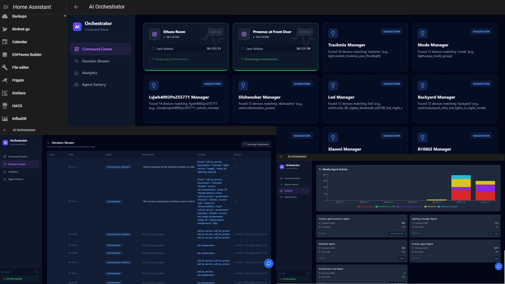

# 🏠 Graham's AI Orchestrator

  

**The Autonomous Multi-Agent Brain for your Smart Home.**

> 🚀 **Alpha Release (v0.9.7)**: Now seeking testers!

The AI Orchestrator transforms your Home Assistant from a collection of manual toggles and rigid automations into a dynamic, thinking ecosystem. It deploys **Autonomous AI Agents** that reason about your home's state, understand your intent, and execute actions intelligently using a built-in RAG Knowledge Base and Safe Tool Execution Engine.


*(Note: Dashboard images are representative)*

---

## 🌟 Why use this?

### 🧠 Real Reasoning, Not Scripts
Instead of writing complex YAML for "If motion > 5mins AND sun is down", just tell an agent:  
> *"You are the Security Guard. If the front porch is occupied for more than 5 minutes at night, turn on the floodlight and notify me."*

### 🗣️ Natural Language Chat
A **Floating Chat Assistant** lives in your dashboard. Talk to your house naturally:
> *"It's movie night. Get the living room ready."*  
> *"Who left the garage door open?"*

### 🔧 No-Code Agent Factory
Don't know how to prompt? The **Architect AI** will interview you and build the perfect agent for your needs automatically. It even surfaces **Smart Suggestions** based on your devices!

### 📚 RAG Knowledge Base
Feed your AI manuals, PDF guides, or specific house rules. The agents read them before acting.
> *"Don't turn on the dishwasher if the 'Clean' sign is flipped."*

### 🎨 AI Visual Dashboard
Experience high-fidelity, skeuomorphic visualizations generated in real-time. The **AI Visual Dashboard** uses advanced LLMs to create stunning, context-aware UIs for your home.
*   **Easy Access**: Access via the new sidebar button or ask the Assistant.
*   **Quick Trigger**: Use the FAB quick actions for instant generation.

---

## 📦 How to Install

1.  **Add Repository**:
    Copy this URL:  
    `https://github.com/ITSpecialist111/HASS-AI-Orchestrator`
    
    Go to **Home Assistant > Settings > Add-ons > Add-on Store > Repositories** (3 dots top right) and add it.

2.  **Install "AI Orchestrator"**:
    Find it in the list and click **Install**.

3.  **Configure**:
    *   **Ollama Models**: Ensure you have pulled the required models on your Ollama server:
        ```bash
        ollama pull deepseek-r1:8b
        ollama pull mistral:7b-instruct
        ollama pull nomic-embed-text  # Mandatory for RAG Knowledge Base
        ```
    *   **Tokens**: Create a Long-Lived Access Token in your Profile.

4.  **Start & Explore**:
    Open the **Web UI** to see your agents thinking in real-time!

---

## 🔒 Privacy & Safety

*   **100% Local**: Works with your local Ollama instance. No data leaves your network.
*   **Safe Execution Engine (v0.9.7)**: 
    *   **Configurable Safety**: All security settings (Allowlists, Blocked Domains, Impact Services, Temp Limits) are now editable via the Add-on Configuration tab in Home Assistant.
    *   **Domain Allowlist**: AI only has access to safe domains (`light`, `switch`, `climate`, etc.) by default.
    *   **Critical Guard**: Dangerous domains (`shell_command`, `hassio`, etc.) are explicitly blocked.
    *   **Approval Queue**: High-impact actions (unlocking doors, disarming alarms) require manual approval.
*   **Dry Run Mode**: Test your agents efficiently without them actually touching your devices until you trust them.

---

## ⚠️ Requirements

*   **Home Assistant OS** (or Supervised)
*   **Ollama Server** (Running locally or on another machine in your network)
*   **Hardware**: Raspberry Pi 4 (8GB) or NUC recommended for fluid dashboard performance. External LLM server recommended for AI speed.

---

[Read Full Documentation](ai-orchestrator/README.md)
