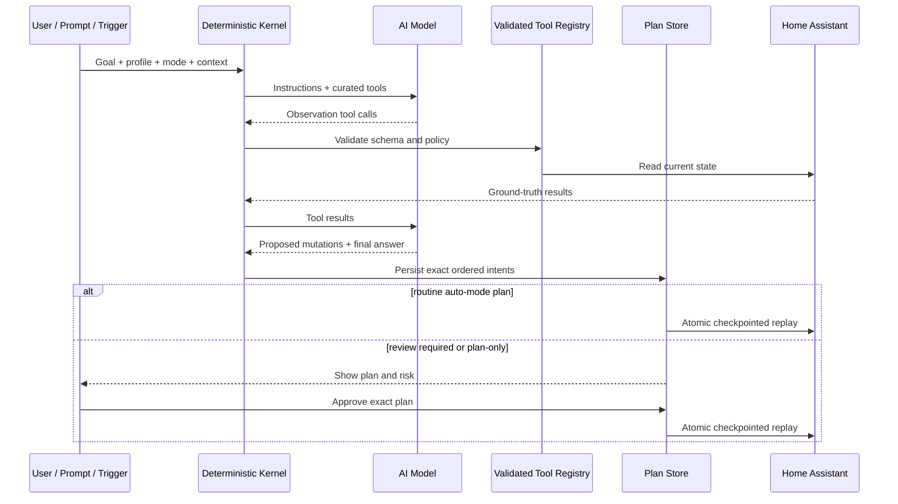
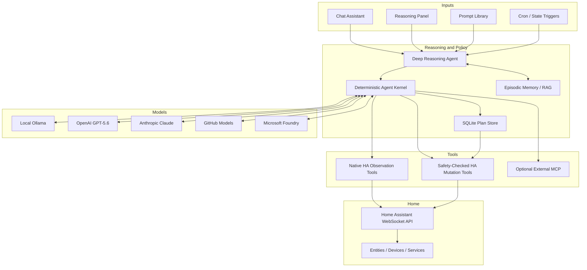

# Graham's AI Orchestrator

[](https://github.com/ITSpecialist111/HASS-AI-Orchestrator/releases/tag/0.13.3)


## A reasoning and policy layer for the intelligent home

Home Assistant is exceptionally good at representing devices, collecting state, and executing deterministic automations. Large language models are good at understanding intent, investigating ambiguous situations, and adapting a plan when the environment is unfamiliar.

**AI Orchestrator is an attempt to combine those strengths without allowing the model to become the safety system.**

It gives an AI model enough Home Assistant context to investigate a goal, but application code remains responsible for:

- which tools exist;
- whether arguments are valid;
- which domains and services are allowed;
- which operations need approval;
- whether calls may run concurrently;
- when retries are safe;
- how long a run may continue;
- what exact actions were approved; and
- what is persisted for audit and later learning.

The long-term goal is not another voice-controlled remote and not a chatbot bolted onto a dashboard. It is a **policy-aware control plane for the home**: a system that can observe, reason, propose, execute safely, verify outcomes, and gradually learn the way a particular home works.

> **Model proposes. Code validates. Humans remain in control. Home Assistant executes.**

### At a glance

- **Today:** run local `gemma4:e4b` in Rapid, Balanced, or Deep mode; investigate live HA state; create exact plans; approve and replay actions; run proactive goals; recall prior episodes; and operate everything from a human-centred dashboard.
- **Safety posture:** dry-run by default, direct execution disabled, sensitive services gated, generated dashboards sandboxed, and mutation replay checkpointed.
- **Next:** native Assist/voice integration, post-action state verification, filtered real-time events, and a temporal model of the home.
- **Latest test release:** [v0.13.3 — Trusted Planner Semantics](https://github.com/ITSpecialist111/HASS-AI-Orchestrator/releases/tag/0.13.3).

### Contents

- [The problem we are trying to solve](#the-problem-we-are-trying-to-solve)
- [What the system can do today](#what-the-system-can-do-today)
- [How a goal moves through the system](#how-a-goal-moves-through-the-system)
- [Architecture](#architecture)
- [Why the kernel is deterministic](#why-the-kernel-is-deterministic)
- [Safety and trust model](#safety-and-trust-model)
- [Model providers](#model-providers)
- [Installation](#installation)
- [Built-in workflows](#built-in-workflows)
- [External MCP](#external-mcp)
- [Privacy and data flow](#privacy-and-data-flow)
- [How this differs from Hermes](#how-this-differs-from-hermes)
- [Evaluation and testing](#evaluation-and-testing)
- [Development](#development)
- [Current status and road to 1.0](#current-status-and-road-to-10)
- [Honest limitations](#honest-limitations)

---

## The problem we are trying to solve

Traditional automations are ideal when every condition and action is known in advance:

```text
if motion detected and sun is below horizon, turn on hallway light
```

Real homes also produce goals that are difficult to encode as one static rule:

- "Audit the whole house for wasted energy and explain the three biggest opportunities."
- "Work out why Ethan's room is cold even though the heating has been running."
- "Prepare the downstairs for movie night, but do not disturb anyone already asleep."
- "Check whether the house is secure and prepare a plan for anything that is not."
- "When solar production is high, decide which flexible loads are sensible to move."

A generic agent can attempt these tasks, but physical-world control adds constraints that normal chat and coding agents do not have:

- stale state can make a previously sensible action wrong;
- two individually valid actions can conflict;
- repeating a command may not be safe;
- service-call acceptance does not prove the device changed;
- a model can produce syntactically plausible but invalid entity IDs;
- a partially executed sequence may be worse than no sequence; and
- locks, alarms, heating, covers, and cameras require different trust boundaries.

AI Orchestrator is being built around those constraints rather than treating them as prompt instructions.

---

## What the system can do today

### Investigate the live home

The reasoning agent can discover entities, search friendly names, inspect full state and attributes, list domains and services, and summarize logical areas. It is instructed to discover before acting instead of inventing entity IDs.

Typical read-only goals:

- whole-home safety, comfort, or energy audits;
- room and device state summaries;
- investigation of unexpected climate behavior;
- checking locks, alarms, cameras, doors, and windows;
- finding unavailable or anomalous entities; and
- consulting locally stored manuals and past reasoning episodes.

### Turn goals into reviewable plans

In `plan` and `auto` modes, state-changing calls are intercepted. The model receives a simulated result so it can finish reasoning, while the runtime records the exact tool name and exact arguments it wanted to use.

The resulting plan includes:

- ordered intents;
- impact classification;
- a human-readable risk summary;
- the reasoning run that produced it;
- whether approval is required; and
- execution results once replayed.

### Execute the exact approved plan

Plan execution does not ask the model to recreate its answer. The stored calls are replayed in order with their captured arguments.

Execution is protected by:

- an atomic claim so two requests cannot execute the same plan concurrently;
- an `executing` state for crash visibility;
- a checkpoint after every completed step;
- trusted approval context supplied by the application, not model arguments;
- stop-on-failure behavior with remaining steps marked as skipped; and
- idempotent responses when an already completed plan is requested again.

### React proactively

The trigger registry supports:

- cron schedules;
- Home Assistant state-change triggers;
- sustained-state requirements;
- cooldown periods;
- templated goals; and
- manual test firing from the dashboard.

Triggers enter the same `auto` reasoning path as interactive goals, so they do not receive a separate safety model.

### Remember useful experience

Optional RAG and episodic memory use ChromaDB plus local Ollama embeddings to store:

- Home Assistant entity capabilities;
- user manuals and local knowledge;
- prior reasoning goals and outcomes;
- tools used and stop reasons; and
- positive or negative user feedback.

Similar past episodes can be recalled before a new run. Feedback changes their future weighting; it does not silently rewrite execution policy.

### Operate from a human-centred dashboard

The React dashboard includes:

| Surface | Purpose |
|---|---|
| **Home** | Connection health, specialist coverage, pending reviews, recent outcomes, and a primary goal composer |
| **Ask & Run** | Select Rapid, Balanced, or Deep; stream grounded progress; cancel safely; and inspect outcomes |
| **Action center** | Review risk and exact captured arguments, then approve or reject deterministic replay |
| **Automation** | Manage specialist agents, create blueprints, and configure cron/state triggers |
| **Advanced insights** | Read a responsive activity feed, disclose technical payloads on demand, and review performance |
| **Dashboard Studio** | Generate, iterate, compare, pin, and live-update visual dashboards |
| **Quick Ask** | Run compact Rapid/Balanced goals through the same authoritative kernel from any page |

Generated Dashboard Studio HTML runs in an opaque sandbox under a restrictive Content Security Policy. Trusted React code obtains Home Assistant state and passes snapshots into the frame; generated code cannot call same-origin APIs.

---

## How a goal moves through the system

Consider this request:

> "Check the downstairs before bedtime. Turn off unnecessary lights and tell me if anything is insecure."

The runtime flow is:

1. **Receive the goal and profile** from Quick Ask, Ask & Run, a reusable prompt, or a trigger.
2. **Recall relevant experience** if episodic memory is enabled.
3. **Expose a curated tool surface** to the selected model.
4. **Observe ground truth** by discovering downstairs entities and reading current state.
5. **Validate every tool request** against JSON Schema and local policy.
6. **Run independent read-only calls concurrently** where safe.
7. **Record mutations as intents** rather than changing the home during planning.
8. **Return observations and simulated results** to the model so it can complete the investigation.
9. **Persist the exact plan** and classify its impact.
10. **Auto-run routine actions or pause for review**, depending on configured policy and impact.
11. **Replay approved calls deterministically** without another model decision.
12. **Checkpoint and log every result** for audit, analytics, and future recall.


```mermaid
sequenceDiagram
    participant U as User / Prompt / Trigger
    participant K as Deterministic Kernel
    participant M as AI Model
    participant T as Validated Tool Registry
    participant P as Plan Store
    participant H as Home Assistant

    U->>K: Goal + profile + mode + context
    K->>M: Instructions + curated tools
    M-->>K: Observation tool calls
    K->>T: Validate schema and policy
    T->>H: Read current state
    H-->>K: Ground-truth results
    K->>M: Tool results
    M-->>K: Proposed mutations + final answer
    K->>P: Persist exact ordered intents
    alt routine auto-mode plan
        P->>H: Atomic checkpointed replay
    else review required or plan-only
        P-->>U: Show plan and risk
        U->>P: Approve exact plan
        P->>H: Atomic checkpointed replay
    end
```

---

## Architecture


```mermaid
flowchart TB
    subgraph Inputs
        CHAT[Chat Assistant]
        REASON[Reasoning Panel]
        PROMPTS[Prompt Library]
        TRIGGERS[Cron / State Triggers]
    end

    subgraph Brain[Reasoning and Policy]
        AGENT[Deep Reasoning Agent]
        KERNEL[Deterministic Agent Kernel]
        MEMORY[Episodic Memory / RAG]
        PLANS[SQLite Plan Store]
    end

    subgraph Models
        OLLAMA[Local Ollama]
        OPENAI[OpenAI GPT-5.6]
        CLAUDE[Anthropic Claude]
        GITHUB[GitHub Models]
        FOUNDRY[Microsoft Foundry]
    end

    subgraph Tools
        OBSERVE[Native HA Observation Tools]
        MUTATE[Safety-Checked HA Mutation Tools]
        MCP[Optional External MCP]
    end

    subgraph Home
        HAWS[Home Assistant WebSocket API]
        DEVICES[Entities / Devices / Services]
    end

    CHAT & REASON & PROMPTS & TRIGGERS --> AGENT
    AGENT <--> MEMORY
    AGENT --> KERNEL
    KERNEL <--> OLLAMA & OPENAI & CLAUDE & GITHUB & FOUNDRY
    KERNEL --> OBSERVE & MUTATE & MCP
    KERNEL --> PLANS
    OBSERVE & MUTATE --> HAWS --> DEVICES
    PLANS --> MUTATE
```

### Core backend components

| Component | Responsibility |
|---|---|
| `reasoning_harness.py` | Provider-neutral model/tool loop, budgets, validation, scheduling, retries, deduplication, traces, and usage |
| `deep_reasoning_agent.py` | Goal lifecycle, memory recall, plan creation, streaming, provider setup, and plan execution |
| `mcp_server.py` | Local Home Assistant tool registry and deployment safety policy |
| `native_ha_tools.py` | Entity discovery, state inspection, service discovery, and area summaries |
| `plan_executor.py` | Mutation interception, impact classification, SQLite persistence, atomic claims, and replay |
| `ha_client.py` | Home Assistant WebSocket authentication, commands, subscriptions, and reconnect loop |
| `external_mcp.py` | Optional Streamable HTTP MCP discovery and invocation |
| `memory_store.py` / `rag_manager.py` | Episodic recall, entity knowledge, manuals, and embeddings |
| `triggers.py` | Cron and sustained state-change reasoning triggers |
| `dashboard_studio.py` | Generated dashboard gallery, lineage, sandboxed rendering, and live entity binding |

The older fixed-cadence specialist-agent runtime is retained for compatibility but disabled by default. Chat, prompts, manual goals, and triggers use the deterministic deep-reasoning kernel.

---

## Why the kernel is deterministic

"Deterministic" does not mean that every model produces the same plan. It means that **the runtime behavior around the model is explicit and reproducible**.

### Tool input validation

Every registered call is checked against JSON Schema before execution. Local Home Assistant policy then validates identifiers, entity domains, service allowlists, blocked domains, temperature bounds, and deployment-specific restrictions.

### Safe concurrency

- A batch containing only read-only, parallel-safe calls may run concurrently.
- If any call mutates state, the entire batch runs in model order.
- A mutation invalidates cached observations from earlier in the run.

### Retry boundaries

- Read-only transient failures may retry with a bounded backoff.
- Mutations are not automatically retried.
- The model receives structured failure information and may choose a different safe approach.

### Duplicate protection

- Identical successful read calls can use the per-run cache.
- Repeated idempotent mutations are deduplicated within a run.
- Repeated non-idempotent operations such as toggles are blocked.

### Hard budgets

The kernel can cap:

- reasoning iterations;
- tool calls per turn;
- total tool calls;
- run wall-clock time;
- individual model calls;
- individual tool calls;
- repeated identical calls;
- consecutive tool-error turns;
- serialized context size; and
- tool-result size.

If the model requests more calls than the budget permits, every rejected call still receives a protocol-valid error result. Provider conversations are never left with unresolved tool calls.

---

## Safety and trust model

Physical-world automation should not rely on "please be careful" in a system prompt. AI Orchestrator uses layered controls:

| Layer | Enforced behavior |
|---|---|
| **Tool exposure** | The model can only request tools registered for the run |
| **Schema validation** | Incorrect types, missing fields, extra fields, and malformed structures are rejected |
| **Identifier validation** | Home Assistant domains, services, and entity IDs must use valid syntax |
| **Domain policy** | Dangerous domains such as `shell_command`, `hassio`, `script`, `automation`, and `rest_command` are blocked by default |
| **Service policy** | Generic calls must match the configured domain and service allowlists |
| **Physical limits** | Climate settings and maximum temperature changes are bounded |
| **Plan interception** | Mutations are recorded during reasoning rather than executed immediately |
| **Impact policy** | Locks, alarms, cameras, broad service calls, and other sensitive operations can require approval |
| **Trusted approval** | Approval status is application context and cannot be forged in model-generated arguments |
| **Atomic replay** | A persisted plan can be claimed by only one executor |
| **Execution checkpoints** | Each completed step is stored; uncertain interrupted work is not blindly replayed |
| **Audit trail** | Goals, calls, results, timing, plans, and stop reasons are logged |
| **Dashboard isolation** | Generated HTML has an opaque origin, restricted scripts, no network access, and no form submission |

The generic native `ha_call_service` path is deliberately not exposed to the reasoning model. Generic mutations use the guarded local `call_ha_service` route so direct WebSocket access cannot bypass policy.

### Important limitation

Version 0.13 records whether Home Assistant accepted a service call, but it does not yet re-observe every affected entity to prove the physical outcome. **Post-action outcome verification is the next major reliability milestone.**

---

## Model providers

AI Orchestrator is provider-neutral at the kernel boundary.

| Provider | Suggested starting point | Integration behavior |
|---|---|---|
| `ollama` | `gemma4:e4b` | Default and most private option; explicit thinking, native tools, and local embeddings when RAG is enabled |
| `openai` | `gpt-5.6-terra` | Uses the Responses API, explicit reasoning effort, and local replay of encrypted reasoning items with provider storage disabled by default |
| `anthropic` | `claude-opus-4-8` | Uses strict tools, adaptive thinking, interleaved reasoning between tools, and signed content-block continuity |
| `github` | A tool-capable model available to the account | Uses GitHub Models' OpenAI-compatible interface |
| `foundry` | A deployed model name | Model-deployment mode keeps tools local; hosted-agent mode owns its remote tool runtime |

Remote deep-reasoner misconfiguration fails explicitly instead of silently changing provider or sending a cloud model name to Ollama.

### One local Gemma, three reasoning profiles

The local default is Ollama's `gemma4:e4b`: the official E4B variant in Gemma 4's roughly 8B-total parameter class. The Ollama artifact is approximately 9.6 GB and advertises a 128K context window. Runtime memory also depends on context and hardware, so field-test it on the target Home Assistant host before disabling dry-run.

Every profile keeps Gemma's recommended sampling (`temperature=1.0`, `top_p=0.95`, `top_k=64`) and the same deterministic tool kernel:

| Profile | Model thinking | Effective default ceiling | Use it for |
|---|---:|---:|---|
| **Rapid** | Off | 6 iterations, 12 tools, 60 seconds | Status checks, direct questions, simple routines |
| **Balanced** | On | 12 iterations, 30 tools, 180 seconds | Everyday planning and multi-step home goals |
| **Deep** | On | 20 iterations, 48 tools, 420 seconds | Complex diagnosis and multi-system investigations |

Ollama returns thinking separately from assistant content. Private scratch reasoning is deliberately excluded from normal history, persisted traces, and the human UI. Operators see observations, guarded tool calls, exact plans, and outcomes instead.

Profiles change model/runtime depth only. They **never** relax schema validation, mutation ordering, retries, deduplication, allowlists, approval requirements, or checkpointed replay.

Official references: [Gemma 4 model card](https://ai.google.dev/gemma/docs/core/model_card_4), [Gemma function calling](https://ai.google.dev/gemma/docs/capabilities/function-calling), [Ollama Gemma 4 library](https://ollama.com/library/gemma4), [Ollama thinking](https://docs.ollama.com/capabilities/thinking), and [Ollama tool calling](https://docs.ollama.com/capabilities/tool-calling).

Cloud providers remain available. Start with GPT-5.6 Terra for a cloud balance of capability and cost, or evaluate GPT-5.6 Sol / Claude Opus 4.8 on representative home scenarios. Higher effort is not automatically safer or better.

---

## Installation

### Requirements

- Home Assistant OS or Supervised with add-on support;
- network access from the add-on to Home Assistant;
- either a local/external Ollama server or credentials for a supported cloud provider;
- sufficient storage for Python dependencies, optional local models, ChromaDB, decisions, and generated dashboards; and
- a Home Assistant Long-Lived Access Token when Supervisor-proxy authentication is not available.

### Install from the Home Assistant repository

1. In Home Assistant, open **Settings → Add-ons → Add-on Store**.
2. Open the three-dot menu and choose **Repositories**.
3. Add:

   ```text
   https://github.com/ITSpecialist111/HASS-AI-Orchestrator
   ```

4. Select **AI Orchestrator** and install it.
5. Open the add-on configuration before the first start.
6. Keep `dry_run_mode` enabled.
7. Configure the model provider and any required credentials.
8. Start the add-on and open its ingress Web UI.

The first build or update can take several minutes because frontend and Python dependencies are installed reproducibly from their lock/requirements files.

### Safe first-run defaults

```yaml
llm_provider: ollama
ollama_host: http://localhost:11434
dry_run_mode: true
enable_rag: true

reasoning_effort: medium
deep_reasoning_model: gemma4:e4b
reasoning_default_profile: balanced
reasoning_max_tool_calls: 48
reasoning_max_seconds: 420
reasoning_llm_timeout: 240
reasoning_tool_timeout: 30
reasoning_max_concurrent_runs: 1

reasoning_allow_direct_execute: false
enable_legacy_autonomous_loops: false
enable_legacy_dashboard_loop: false
```

### Recommended first test

1. Confirm Home shows a live connection and Ask & Run reports `ollama / gemma4:e4b`.
2. Select **Rapid** and run a read-only goal:

   > Audit the home for unavailable entities. Do not change anything.

3. Inspect the reasoning trace and verify discovered entity IDs are real.
4. Select **Balanced**, choose **Plan only**, and run:

   > Plan how to turn on the kitchen lights at 30% brightness. Do not execute it.

5. Confirm that a pending plan contains the expected entity, service, and arguments.
6. Keep global dry-run enabled while testing plan approval and replay behavior.
7. Review configured domain/service allowlists before disabling dry-run.
8. Test routine lighting before climate or security operations.

Back up `/data/chroma` before upgrading an existing installation from the old ChromaDB version.

For the complete add-on settings and operator-focused notes, see [ai-orchestrator/README.md](ai-orchestrator/README.md).

---

## Built-in workflows

The native prompt library currently includes reusable starting points for:

- whole-home audit;
- security check;
- energy optimization;
- morning routine;
- nightly review.

Prompts are YAML templates shipped in [ai-orchestrator/backend/prompts](ai-orchestrator/backend/prompts). User prompt directories and optional external MCP prompts can extend the catalog.

---

## External MCP

No external MCP server is required. Native Home Assistant observation and safety-checked mutation tools ship with the add-on.

An optional Streamable HTTP MCP server can add tools, resources, and prompts. The client supports:

- tool, resource, and prompt discovery;
- structured content and output schemas;
- tool execution errors visible to the model;
- per-call timeouts; and
- collision-safe tool namespacing.

Remote MCP annotations are retained as metadata but are not trusted automatically to downgrade local safety policy.

---

## Privacy and data flow

### Local-first mode

With Ollama and local embeddings:

- goals and Home Assistant state remain on the local network;
- ChromaDB data is stored under the add-on data directory;
- plans, approvals, triggers, and decision logs use local SQLite/files;
- no external MCP is required; and
- generated dashboards are stored locally.

### Cloud providers

When a cloud model is selected, the prompts, selected Home Assistant context, tool definitions, and tool results needed for the run are sent to that provider. Users should review the provider's retention and regional-processing terms before enabling it.

For OpenAI GPT-5.6, response storage is disabled by default. Encrypted reasoning items are replayed locally between turns so reasoning continuity does not require a stored provider conversation.

API keys are read from Home Assistant add-on options/environment and are not written to decision traces by design. Never place credentials in agent instructions, prompt templates, entity names, or tool schemas.

---

## How this differs from Hermes

[Hermes Agent](https://hermes-agent.nousresearch.com/docs/user-guide/messaging/homeassistant/) is a strong general-purpose agent environment. It currently has broader messaging integrations, self-improving skills, plugins, profiles, terminal access, an OpenAI-compatible API, and a filtered real-time Home Assistant event gateway.

AI Orchestrator is pursuing a narrower and deeper role:

| Hermes strength | AI Orchestrator focus |
|---|---|
| General-purpose personal agent and tool shell | Home-specific reasoning and policy control plane |
| Messaging, terminal, plugins, and self-modification | Deterministic physical-world tool policy and auditability |
| Direct Home Assistant entity/service tools | Exact reviewable plans and checkpointed replay |
| Broad skill ecosystem | Conflict handling, simulations, evaluations, and eventual outcome verification |
| Filtered event gateway | Event-sourced home episodes and deterministic trigger evaluation—the next milestone |

The aim is not to recreate Hermes. The aim is to become the layer that can safely answer: **"Given what is happening in this particular home, what should happen next, why, under whose authority, and did it actually work?"**

---

## Evaluation and testing

Safety-critical behavior is tested without relying on an LLM judge.

### Deterministic runtime contracts

[ai-orchestrator/backend/tests/test_agent_kernel_2026.py](ai-orchestrator/backend/tests/test_agent_kernel_2026.py) covers:

- invalid argument rejection;
- read/write ordering;
- retry boundaries;
- idempotent deduplication;
- non-idempotent duplicate blocking;
- budget rejection with valid protocol results;
- result compaction;
- model timeout handling;
- usage aggregation;
- atomic plan claims;
- blocked Home Assistant domains and malformed IDs;
- trusted high-impact plan execution;
- Claude tool/thinking continuity;
- GPT-5.6 encrypted reasoning continuity;
- explicit provider selection; and
- generated-dashboard sandbox headers.

### Model behavior scenarios

[ai-orchestrator/backend/evals/home_agent_scenarios.yaml](ai-orchestrator/backend/evals/home_agent_scenarios.yaml) defines representative goals for state lookup, discovery-before-action, security approval, blocked admin domains, climate conflict, duplicate protection, ambiguity, audit, unavailable entities, and bounded large-home investigation.

The scorer uses deterministic assertions for mutations, approvals, tool budgets, and forbidden tools instead of asking another model whether the run was safe.

### Verified release baseline

- **285 backend tests passing**;
- **4 opt-in live external-MCP tests skipped** when no live server is configured;
- frontend clean install and production build passing;
- frontend dependency audit reporting **0 vulnerabilities**;
- Python dependency consistency passing; and
- configuration, syntax, and diff checks passing.

---

## Development

### Backend

Python 3.11 or 3.12 is recommended.

```powershell
py -3.12 -m venv .venv
.\.venv\Scripts\python.exe -m pip install -r ai-orchestrator/backend/requirements-dev.txt
Push-Location ai-orchestrator/backend
..\..\.venv\Scripts\python.exe -m pytest -q
Pop-Location
```

### Dashboard

Node.js 22 is used by the container build.

```powershell
Push-Location ai-orchestrator/dashboard
npm ci
npm audit
npm run build
Pop-Location
```

### Reproducible test image

The root test image performs a lockfile-only frontend install/audit/build and then assembles the Python test environment:

```text
docker build -f Dockerfile.test -t ai-orchestrator:test .
docker run --rm ai-orchestrator:test
```

---

## Repository map

```text
ai-orchestrator/
├── backend/
│   ├── agents/                 Goal-driven and specialist agent implementations
│   ├── evals/                  Provider-neutral model behavior scenarios
│   ├── prompts/                Built-in reusable home workflows
│   ├── tests/                  Runtime, API, safety, provider, and integration tests
│   ├── reasoning_harness.py    Deterministic provider-neutral agent kernel
│   ├── plan_executor.py        Plan interception, persistence, claims, and replay
│   ├── mcp_server.py           Safety-checked Home Assistant mutation tools
│   ├── native_ha_tools.py      Native observation and discovery tools
│   ├── external_mcp.py         Optional remote MCP client
│   ├── memory_store.py         Episodic memory and feedback
│   ├── rag_manager.py          ChromaDB and local embedding integration
│   ├── triggers.py             Cron and state-change proactive goals
│   └── main.py                 FastAPI lifecycle and public API
├── dashboard/                  React monitoring, reasoning, plans, triggers, and studio UI
├── skills/                     Specialist-agent compatibility instructions
├── agents.yaml                 Example specialist profiles
├── config.json                 Home Assistant add-on manifest and option schema
├── Dockerfile                  Multi-stage add-on image
└── run.sh                      Home Assistant add-on entrypoint
```

---

## Current status and road to 1.0

Version 0.13 adds one coherent local reasoning engine and a human control layer on top of the 0.12 deterministic foundation. The project remains pre-1.0 while it gains live-home evidence and first-class Home Assistant surfaces.

### Highest-priority next steps

1. **Native Home Assistant conversation integration** using `ConversationEntity`, `ChatLog`, `LLMContext`, exposed-entity policy, conversation IDs, and Assist voice pipelines.
2. **Post-action outcome verification** that re-observes affected entities and records verified, failed, or uncertain outcomes.
3. **Filtered real-time event intake** with domain/entity filters, noisy-entity exclusions, cooldowns, and deterministic pre-model gates.
4. **Temporal world model** using Home Assistant recorder/statistics for occupancy, comfort, energy, and anomaly baselines.
5. **Learned policy proposals compiled to deterministic rules**, with simulation and review before activation.
6. **Real-provider evaluation CI** comparing task success, safety, calls, tokens, latency, and cost before model/prompt upgrades.
7. **OpenTelemetry-compatible run export** built on the existing run IDs, usage, tool metadata, and checkpoints.

See [ROADMAP.md](ROADMAP.md) for the wider product direction.

---

## Honest limitations

- Active model conversations are not yet resumed across a process restart; persisted plans are durable.
- An interrupted `executing` plan is intentionally not replayed automatically because a command may already have reached a physical device.
- Service-call success is not yet the same as verified device outcome.
- Native Home Assistant Assist/voice integration is planned but not included in 0.13.
- Real model quality depends on the chosen model, available context, entity naming, and the deployment's tool policy.
- Generated dashboards are isolated, but their visual quality still depends on the selected model.
- Legacy agent profiles remain in the product, while their periodic autonomous loops are disabled by default.

---

## Documentation

- [Add-on configuration and operator guide](ai-orchestrator/README.md)
- [Gemma E4B profile and human UI design record](GEMMA_UI_0_13.md)
- [2026 architecture review, research, and breaking changes](MODERNIZATION_2026.md)
- [Product roadmap](ROADMAP.md)
- [Testing guide](TESTING.md)
- [Changelog](CHANGELOG.md)
- [v0.13.3 release](https://github.com/ITSpecialist111/HASS-AI-Orchestrator/releases/tag/0.13.3)
- [v0.13.2 release](https://github.com/ITSpecialist111/HASS-AI-Orchestrator/releases/tag/0.13.2)
- [v0.13.1 release](https://github.com/ITSpecialist111/HASS-AI-Orchestrator/releases/tag/0.13.1)
- [v0.13.0 release](https://github.com/ITSpecialist111/HASS-AI-Orchestrator/releases/tag/0.13.0)

Issues, field-test results, model comparisons, and Home Assistant deployment feedback are welcome in the [GitHub issue tracker](https://github.com/ITSpecialist111/HASS-AI-Orchestrator/issues).
