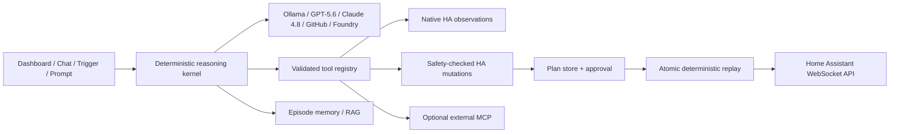

# AI Orchestrator 0.13

A local-first, deterministic AI control plane for Home Assistant.

> This page focuses on installation, configuration, and runtime policy. For the full product vision, use cases, architecture, safety story, Hermes positioning, privacy model, and road to 1.0, read the [main project README](../README.md).

AI Orchestrator observes the real home, reasons with local or cloud models, and turns model requests into validated, reviewable Home Assistant operations. The model proposes; application code enforces schemas, policy, budgets, ordering, approval, and replay.

## What is authoritative in 0.13

- **One reasoning kernel** for dashboard goals, chat, prompts, and proactive triggers.
- **One local model** by default: `gemma4:e4b`, selectable per run as Rapid, Balanced, or Deep.
- **Observation before action** with native entity, state, domain, service, and area tools.
- **Plan → Approve → Execute** for mutations. Approved plans replay exact captured arguments without another model call.
- **Deterministic tool scheduler**: read-only calls may run concurrently; any batch containing a mutation runs in model order.
- **Application-side JSON Schema validation** before every tool call.
- **Bounded recovery**: read-only transient failures retry; mutations do not retry automatically.
- **Duplicate protection**: repeated idempotent actions are deduplicated and repeated non-idempotent actions are blocked within a run.
- **Hard budgets** for iterations, total tool calls, wall time, model timeout, tool timeout, context, and result size.
- **Human review** for high-impact plans and security services.
- **Durable execution claims and per-step checkpoints** in SQLite, preventing concurrent double execution.
- **Episodic memory**, built-in prompt workflows, cron/state triggers, external MCP, and Dashboard Studio remain supported.
- **Human operations UI** organized around Home, Ask & Run, Plans, Automation, Insights, and Studio, with responsive mobile navigation and accessible focus states.

Legacy cadence-based specialist loops and the legacy dashboard generator are disabled by default. They can be enabled for compatibility, but the deterministic kernel is the recommended runtime.

## Model providers

| Provider | Suggested model | Notes |
|---|---|---|
| `ollama` | `gemma4:e4b` | Default; explicit thinking and native tool calling while home data remains local. |
| `openai` | `gpt-5.6-terra` | Uses the Responses API, persisted reasoning, and local encrypted-state replay with `store=false`. Use `gpt-5.6-sol` for maximum capability. |
| `anthropic` | `claude-opus-4-8` | Uses strict tools, adaptive thinking, interleaved tool reasoning, and explicit effort. |
| `github` | A model available to the GitHub Models account | OpenAI-compatible tool calling. |
| `foundry` | A deployed model name | Model-deployment mode keeps local tool execution. Hosted-agent mode owns its server-side tools. |

Remote-provider misconfiguration fails the deep reasoner explicitly instead of silently sending a cloud model ID to Ollama. Other add-on services still start and report degraded health.

### Local reasoning profiles

All three profiles use the same Gemma E4B model and recommended sampling. Profiles only change explicit thinking and bounded runtime/output depth:

| Profile | Thinking | Default effective ceilings |
|---|---|---|
| `rapid` | Off | 6 iterations, 12 total tools, 60 seconds |
| `balanced` | On | 12 iterations, 30 total tools, 180 seconds |
| `deep` | On | 20 iterations, 48 total tools, 420 seconds |

Deployment-level settings remain hard ceilings. No profile can increase permission, bypass approval, reorder mutations, or weaken deterministic tool policy. Ollama's separate `message.thinking` field is intentionally excluded from traces and subsequent history.

## Recommended first-run configuration

1. Leave `dry_run_mode: true`.
2. Keep `reasoning_allow_direct_execute: false`.
3. Choose `llm_provider` and set its model/credential fields.
4. Keep `reasoning_default_profile: balanced`; use Rapid for checks and Deep only for genuinely complex goals.
5. Keep `reasoning_effort: medium` for cloud providers initially; evaluate before raising it.
6. Run read-only audits and Plan-only scenarios.
7. Review plans in the dedicated Plans workspace.
8. Disable global dry-run only after the tool allowlists and entity targets are correct.

Important defaults:

```yaml
llm_provider: ollama
deep_reasoning_model: gemma4:e4b
reasoning_default_profile: balanced
dry_run_mode: true
enable_rag: true
reasoning_effort: medium
deep_reasoning_max_iterations: 20
reasoning_max_tool_calls: 48
reasoning_max_seconds: 420
reasoning_llm_timeout: 240
reasoning_tool_timeout: 30
reasoning_max_concurrent_runs: 1
reasoning_allow_direct_execute: false
enable_legacy_autonomous_loops: false
enable_legacy_dashboard_loop: false
```

## Safety model

1. The model only sees registered schemas.
2. Tool arguments are validated against JSON Schema in the kernel.
3. The local tool server validates entity domain, temperature, domain allowlist, blocked domains, and service allowlist.
4. Plan/auto mode intercepts mutations and records exact intents.
5. High-impact intents remain pending until a human executes the plan.
6. Execution atomically claims the plan, carries trusted approval context, and checkpoints every completed step.
7. Failure aborts remaining ordered steps and marks them skipped.
8. Every call and plan result is logged.

The generic native `ha_call_service` route is not exposed to the reasoning model. Generic service calls use the guarded local `call_ha_service` route, so native WebSocket access cannot bypass policy.

## External MCP

External MCP is optional and additive. The client supports current Streamable HTTP discovery, structured content, output schemas, tool errors, and per-call timeouts. External annotations are retained as metadata but never automatically trusted to downgrade local safety policy.

## Evaluation

Two layers are included:

- `tests/test_agent_kernel_2026.py`: model-free executable safety and determinism contracts.
- `evals/home_agent_scenarios.yaml`: representative model scenarios with deterministic pass/fail assertions for tool budgets, mutations, approvals, and forbidden tools.

Validate the dataset:

```text
python evals/scenario_contract.py
```

Run the backend suite from the backend directory:

```text
pytest -q
```

## Runtime architecture



## Installation

Add this repository to the Home Assistant Add-on Store, install **AI Orchestrator**, configure the provider, and open the ingress dashboard. If Ollama or RAG uses a local host, the container starts the local Ollama service and pulls configured models when needed.

For architecture decisions, breaking changes, research sources, and the next roadmap, see [../MODERNIZATION_2026.md](../MODERNIZATION_2026.md).
